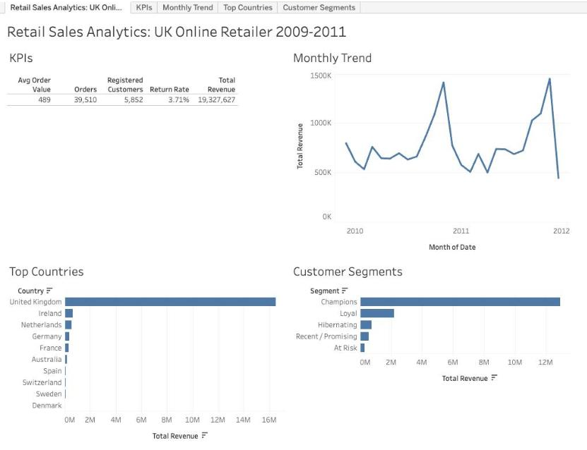
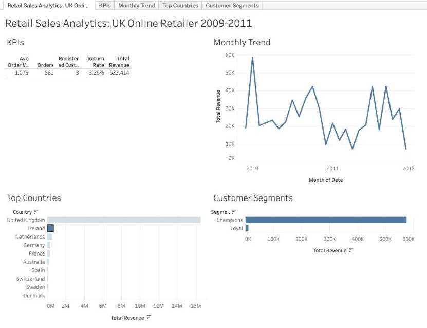

# Retail Sales Analytics: Python Data Cleaning + Tableau Dashboard

End-to-end analysis of **1,067,371 real e-commerce transactions** from a UK online
gift retailer (Dec 2009 to Dec 2011, 43 countries). Raw data is cleaned in Python
(Pandas), modelled as a star schema, and analysed in an interactive Tableau dashboard
to answer business questions about revenue, customers, markets and returns.

**Live dashboard:** [Retail Sales Analytics on Tableau Public](https://public.tableau.com/app/profile/mayank.thakur8557/viz/RetailSalesAnalytics_17898484582950/Sheet1)

**Dataset:** [UCI Online Retail II](https://archive.ics.uci.edu/dataset/502/online+retail+ii)
(Chen, 2019), CC BY 4.0.



## Business questions

1. How is revenue trending, and how seasonal is the business?
2. Which markets drive revenue?
3. Who are the most valuable customers, and who is at risk of churning?
4. How much revenue is lost to returns?

## Pipeline

```
Raw Excel (1.07M rows)
  -> scripts/clean_data.py        Pandas: 6 cleaning steps, each logged with row counts
  -> data/clean/*.csv             Star schema: 2 fact tables + 3 dimension tables
  -> scripts/validate_metrics.py  Answer key for every dashboard number
  -> scripts/build_tableau_file.py  One flat file for Tableau (sales + returns + segments)
  -> Tableau Public               Calculated fields, 4 sheets, interactive dashboard
```

## Data cleaning

Full log: [`reports/cleaning_report.md`](reports/cleaning_report.md)

| Step | Rows removed | Why |
|---|---:|---|
| Drop exact duplicate rows | 34,335 | Same line recorded twice |
| Remove non-product lines | 5,980 | Postage, bank charges, Amazon fees, manual adjustments |
| Split cancellations into a returns table | 17,914 moved | Kept separately to measure return rate |
| Remove zero or negative quantity/price | 5,928 | Stock write-offs, not real sales |
| Remove bulk orders cancelled in full | 46 | Mistaken 1,000+ unit orders that would inflate revenue |
| Label missing customer IDs as "Guest" | 0 (226,637 labelled) | Kept for revenue totals, excluded from customer analysis |

Result: **1,003,168 clean sales lines** and **17,914 return lines**.

## Data model (star schema)

| Table | Type | Rows | Key |
|---|---|---:|---|
| fact_sales | Fact | 1,003,168 | Invoice line |
| fact_returns | Fact | 17,914 | Return line |
| dim_customer | Dimension | 5,853 | CustomerID (with RFM segment) |
| dim_product | Dimension | 4,706 | StockCode |
| dim_date | Dimension | 739 | Date |

Customers are segmented with **RFM analysis** (Recency, Frequency, Monetary quartiles)
into Champions, Loyal, Recent/Promising, At Risk and Hibernating.

## Dashboard

Built in Tableau Public with 6 calculated fields (Total Revenue, Orders, Avg Order Value,
Return Value, Return Rate, Registered Customers). Every number was checked against the
Python answer key in [`reports/key_metrics.md`](reports/key_metrics.md).

- **KPIs:** revenue, orders, average order value, registered customers, return rate
- **Monthly Trend:** revenue by month, Dec 2009 to Dec 2011
- **Top Countries:** top 10 markets by revenue
- **Customer Segments:** revenue by RFM segment
- **Interactive:** click any country or segment to filter the whole dashboard

Clicking **Ireland** shows its £623K revenue comes from just 3 registered customers
with a £1,073 average order: large wholesale accounts, very different from the UK.



## Key insights

| Metric | Value |
|---|---:|
| Total revenue | £19.33M |
| Orders | 39,510 |
| Average order value | £489 |
| Registered customers | 5,852 |
| Return rate (by value) | 3.7% |

1. **Highly seasonal:** September to December brings **46% of annual revenue**;
   the peak month is November 2011 (£1.45M). Stock and staffing should ramp up from August.
2. **Flat growth:** like-for-like revenue (Jan to Nov) grew only **2.1%** from 2010 to 2011.
3. **UK-dependent:** the UK is **85% of revenue**. The next markets are Ireland,
   the Netherlands, Germany and France: the clearest expansion targets.
4. **Customer concentration:** the top **10% of customers bring 63%** of registered revenue.
   **Champions** (1,805 customers) generate **77%**. Losing a few key accounts is a real risk.
5. **Strong loyalty:** **72%** of customers ordered more than once.
6. **Churn risk:** 458 "At Risk" customers were frequent buyers who have gone quiet:
   a win-back campaign target.
7. **Operations:** almost no Saturday revenue (£10K vs £3.99M on Thursdays), suggesting
   orders are not processed on Saturdays.
8. **Guest checkouts:** 13% of revenue has no customer ID, so it cannot be used for
   retention marketing. Encouraging account sign-up would close this gap.

## Tech stack

Python (Pandas), Tableau (calculated fields, dashboard actions), Excel, Git

## Run it

```bash
python3 -m venv .venv && .venv/bin/pip install pandas openpyxl
# download online_retail_II.xlsx from the UCI link above into data/raw/, then:
.venv/bin/python scripts/convert_raw.py         # xlsx -> csv
.venv/bin/python scripts/clean_data.py          # clean + build star schema
.venv/bin/python scripts/validate_metrics.py    # answer key
.venv/bin/python scripts/build_tableau_file.py  # flat file for Tableau
.venv/bin/python scripts/slim_tableau_file.py   # smaller upload (only used columns)
```

## Repo structure

```
retail-sales-analytics/
├── scripts/        # cleaning, validation and Tableau export scripts
├── data/clean/     # star schema CSVs (fact_sales is regenerated, not committed)
├── reports/        # cleaning_report.md, key_metrics.md
├── screenshots/    # Tableau dashboard
└── powerbi/        # optional: DAX measures and guide for rebuilding in Power BI
```
